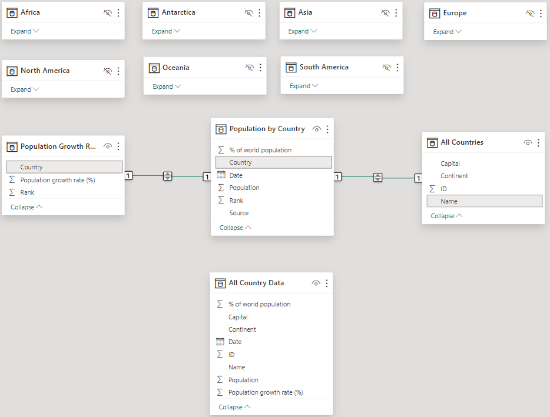
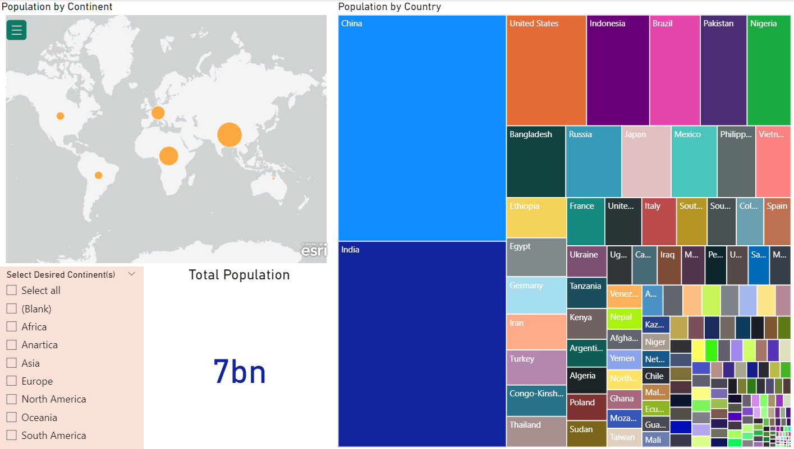

# Power BI Example Work

## Country Populations

### Features
* Import 2 Excel files with multiple tabs (CountryPops.xlsx, GrowthRates.xlsx)
* Transform the data as follows:
    * Convert the single continent tables within CountryPops into a single table using Append functionality
    * Create a single table for all country data including population and population metrics using Merge functionality
    * Clean header names and index columns for readability
    * Create appropriate relationships between tables.
* Create a simple population report that does the following:
    * Allow filtering all visuals by continent including a Select All option
    * Single total population indicator
    * Geographical representation with sum of population and sum of % of world population tool tips
    * Spatial representation by country name relevant to population size with population, % of world population, and population growth tool tips
    * Allow highlighting selected items across visuals in addition to the filter
* Create a Q&A report page
    * Include a matrix by Country that includes population, % World Population, and Population Growth with bar indicators for the latter two
    * Update Q&A tool synonyms accordingly (e.g. capital is not $ related in this data)
    * Seed the Q&A with two questions

**Note:** For more a complex reporting example, refer to my [Citi Bike Analysis](https://github.com/vt-bekah/Citi-Bike-PowerBI-Analysis) - data see too large to upload pbix file

### Data Source
[Learning Power BI Desktop LinkedIn Learning course by Gini von Courter](https://www.linkedin.com/learning/learning-power-bi-desktop-16568640/next-steps?autoSkip=true&resume=false)

### File Structure
* All_Countries.pbix contains the transformed data and reports
* Data\CountryPops.xlsx & Data\GrowthRates.xlsx are the original files downloaded from the course

### Table Relationships

### Simple Population Report Page
