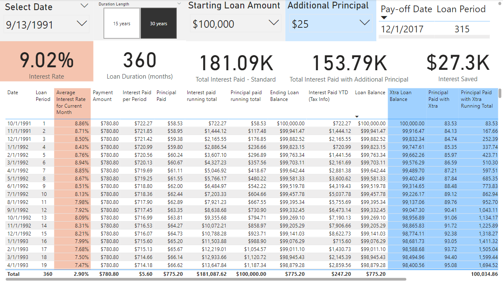

**Power BI Example Work**

-----------------------------------------------------------------------------------------------

# Country Populations

### Features
* Import 2 Excel files with multiple tabs (CountryPops.xlsx, GrowthRates.xlsx)
* Transform the data as follows:
    * Convert the single continent tables within CountryPops into a single table using Append functionality
    * Create a single table for all country data including population and population metrics using Merge functionality
    * Clean header names and index columns for readability
    * Create appropriate relationships between tables.
* Create a simple population report that does the following:
    * Allow filtering all visuals by continent including a Select All option
    * Single total population indicator
    * Geographical representation with sum of population and sum of % of world population tool tips
    * Spatial representation by country name relevant to population size with population, % of world population, and population growth tool tips
    * Allow highlighting selected items across visuals in addition to the filter
* Create a Q&A report page
    * Include a matrix by Country that includes population, % World Population, and Population Growth with bar indicators for the latter two
    * Update Q&A tool synonyms accordingly (e.g. capital is not $ related in this data)
    * Seed the Q&A with two questions

**Note:** For a more complex reporting example, refer to my [Citi Bike Analysis](https://github.com/vt-bekah/Citi-Bike-PowerBI-Analysis) - data see too large to upload pbix file

### Data Source
[Learning Power BI Desktop LinkedIn Learning course by Gini von Courter](https://www.linkedin.com/learning/learning-power-bi-desktop-16568640/next-steps?autoSkip=true&resume=false)

### File Structure
* All_Countries.pbix contains the transformed data and reports
* Data\CountryPops.xlsx & Data\GrowthRates.xlsx are the original files downloaded from the course

### Table Relationships

### Simple Population Report Page

-----------------------------------------------------------------------------------------------
-----------------------------------------------------------------------------------------------

# Home Loan Modeling (DAX heavy)

### Features
* Download the 15-year and 30-year U.S. mortgage rates from [FRED](https://fred.stlouisfed.org/) and store in CSV files
* Import and Transform the FRED data as follows:
    * Merge the the 15-year and 30-year interest rate based on date
    * Remove entries that do not have both 15-year and 30-year mortgages
* Create additional tables to support user input filtering and calculations
    * Dates table that includes the first of each month from the start of of the transformed data through 30 years after the final date
    * Loan Duration table to allow selecting between 15-year and 30-year mortgages
    * Loan Period table with a column for loan period (1-360) and years into loan (1-30)
* Create the following calcuations
    * Loan Start & Duration based on user input
    * Interest Rate
    * Monthly Interest Rate
    * Loan Period
    * Monthly Payment Amount
    * Loan Balance throughout loan
    * Interest paid in given month
    * Principal paid in given month
    * Average interest rate for a given month
    * Running totals for interest and principal paid running totals
    * Ending loan balance
    * Interest paid YTD
* Create a Loan Model Details report:
    * Loan Start Date & Loan Duration selectors
    * For each payment period: Date, Loan Period, Payment Amount, Interest Paid & Running Total, Principal Paid & Running Total, Ending Loan Balance, Interest Paid Year-to-Date (for taxes purposes), Average Interest Rate for Current Month (time to refinance?)
* Create a dashboard report with:
    * Loan Start Date & Loan Duration selectors
    * 15-year & 30-year interest rate over time line chart
    * Loan Balance vs. Time line graph with 50% marker
    * Payment make-up over time with 50% marker
* Add the ability to account for users paying additional principal as well as easily modify initial loan amount:
    * Add a selector for starting loan amount
    * Add a selector for additional monthly principal
    * Add calculations that account for additional principal payments:
        * Total principal paid each month from monthly payment + additional and running total
        * Innterest paid each month accounting for further reduced principal and running total
        * Loan Balance when accounting for additional principal
    * Create a new dashboard similar to the original:
        * new user controls for loan amount and additional principal
        * modify the line chart to show standard pay-off and additional principal pay-off

**Future Features:** 
* Add card to indicate pay-off date
* Add card to total interest paid in both scenarios

### Data Source
[Federal Reserve Economic Data](https://fred.stlouisfed.org/)

### File Structure
* Loan_Dashboard.pbix contains the transformed data and reports
* Data\MORTGAGE15US.xlsx & Data\MORTGAGE30US.xlsx are the files downloaded from FRED

### Loan Dashboard with Additional User Control Including Additional Principal Payments

### Loan Details

### Original Loan Dashboard

